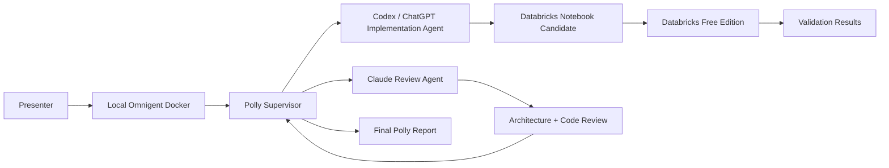

# Polly as the Show-Runner for a Multi-Agent Databricks Coding Team

## Overview

This demo shows how **Polly**, running through **Omnigent**, can act as the project manager for a multi-agent coding team that builds and reviews a Databricks data product in real time.

The core idea is simple:

> Polly takes one high-level Databricks requirement. Polly breaks it into tasks, routes implementation to Codex / ChatGPT, routes architecture and code review to Claude, resolves feedback, and guides the final execution in Databricks Free Edition.

## Demo Goal

Build a small, self-contained Databricks retail analytics notebook that:

- Creates synthetic retail event data.
- Builds bronze, silver, and gold analytics views.
- Trains a simple forecasting model.
- Runs validation checks.
- Produces a final implementation summary.

The notebook is intentionally lightweight so the live session focuses on **multi-agent orchestration**, not cluster setup or data access friction.

## Architecture

## Agent Roles

| Agent | Role | Responsibilities |
| --- | --- | --- |
| Polly | Show-runner / project manager | Intake, decomposition, routing, decision tracking, conflict resolution, final report |
| Codex / ChatGPT | Implementation agent | PySpark, SQL, notebook generation, validation checks |
| Claude | Architecture and review agent | Design review, documentation review, code quality, Databricks best practices |
| Human presenter | Final approver | Chooses what to run, approves final notebook, explains tradeoffs |

## Demo Workflow

1. **Requirement intake**  
   Polly receives the user story: build a Databricks retail analytics notebook.

2. **Task decomposition**  
   Polly splits the work into ingestion, transformation, gold metrics, ML, validation, review, and reporting.

3. **Agent assignment**  
   Codex / ChatGPT owns implementation. Claude owns review.

4. **Notebook implementation**  
   Codex generates a Databricks Python/PySpark notebook.

5. **Cross-agent review**  
   Claude reviews for architecture quality, repeatability, Databricks compatibility, and demo readiness.

6. **Conflict resolution**  
   Polly handles disagreement between implementation and review suggestions.

7. **Revision loop**  
   Polly routes accepted feedback back to the implementation agent.

8. **Databricks execution**  
   The presenter runs the approved notebook in Databricks Free Edition.

9. **Validation display**  
   The notebook shows output tables and validation results.

10. **Final report**  
   Polly summarizes what happened, which agent did what, and what production hardening remains.

## Final Takeaway

Polly makes the demo compelling because it shows a realistic agent operating model:

- One high-level requirement.
- Multiple specialist agents.
- Clear task ownership.
- Cross-agent review.
- Conflict resolution.
- Human approval.
- Databricks execution.
- Final traceable report.
